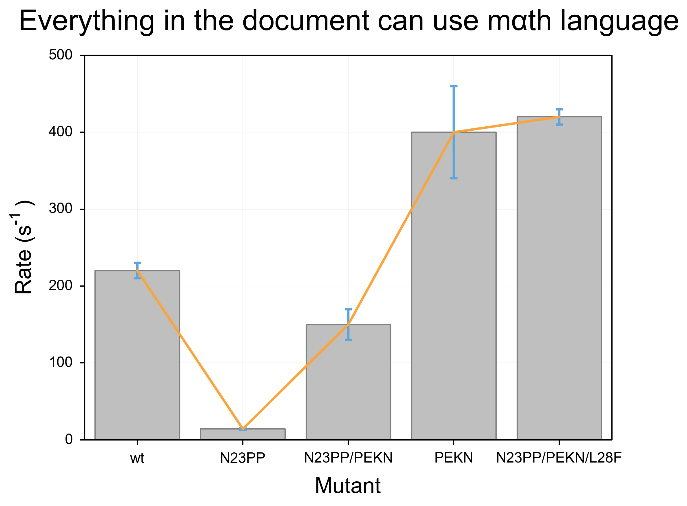
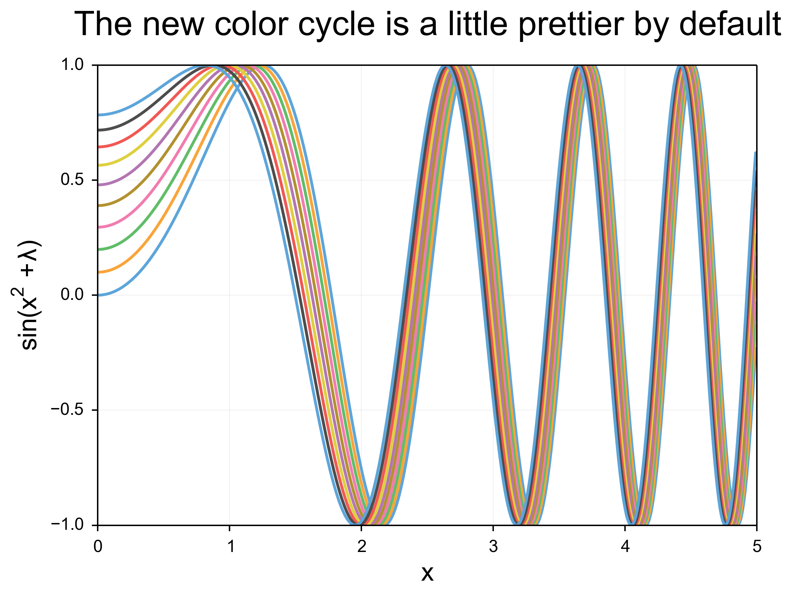

matplotlibrc
======================

##Summary:





This matplotlibrc provides a quick starting point so that any plotting you do with matplotlib looks nice off the bat. It includes font sizing, nice formatting of subscripted and superscripted text (with mathtext), a better color wheel, high-dpi defaults, a pretty grid, outward-facing tickmarks, and nicer line bend handling.

Unfortunately, the ticks by default are on the outside of all 4 sides, which I am not a huge fan of. This can only be solved with code within the script (below).

The title also correspondingly hangs too low with the new, larger font. To fix this, declare "y=1.08" as an argument when making your title. I also recommend adding some padding around the labels with "labelpad=10"

Examples of these changes are below as well as in the test script which generates the image at the top of this readme.

##Example usage:

This script will work with any matplotlib as long as it is in the right place (see Conditions to Run) but I recommend the following additional bits in your plotting script:

```python
ax.yaxis.set_ticks_position('left') # this one is optional but I still recommend it...
ax.xaxis.set_ticks_position('bottom')
ax.set_title("Title goes here", y=1.05)
ax.set_ylabel("Ylabel Goes Here", labelpad=10)
ax.set_xlabel("XLabel goes here",labelpad=10)
```

Additionally, you should probably mess with the formatting for error bars but I don't have a recommended setting for this... Please contribute if you find one!

##Conditions to run:

Copy the `matplotlibrc` file to `~/.matplotlib/matplotlibrc`.

If you feel fancy, you can run:

```bash
ln -s ./matplotlibrc ~/.matplotlibrc/matplotlibrc
```

###Software requirements:

```
python==2.7.8
matplotlib==1.3.1
```

### Citations
I shamelessly copied the color wheel from Stephen Few's book [Show me the Numbers](http://www.amazon.com/Show-Me-Numbers-Designing-Enlighten/dp/0970601972/ref=sr_1_1?s=books&ie=UTF8&qid=1376149971&sr=1-1&keywords=show+me+the+numbers)
